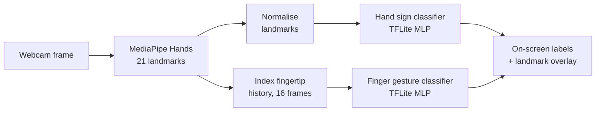

# Hand Gesture Recognition


Real-time hand gesture recognition from a webcam. MediaPipe detects 21 landmarks on the hand, and two lightweight neural networks classify them: one recognises **hand signs** (open hand, fist, pointing, OK) and the other recognises **finger movements** (such as drawing a circle in the air). The retrained hand sign classifier reaches **95.4% accuracy** on held-out data.

> This project builds on the open-source [hand-gesture-recognition-using-mediapipe](https://github.com/Kazuhito00/hand-gesture-recognition-using-mediapipe) by Kazuhito Takahashi, in its [English translation](https://github.com/kinivi/hand-gesture-recognition-mediapipe) by Nikita Kiselov. See [Credits and license](#credits-and-license).

---

## How it works



1. **Hand tracking.** MediaPipe Hands finds the hand in each frame and returns 21 landmark points (wrist, knuckles and fingertips) plus whether it is a left or right hand.
2. **Normalisation.** Landmark coordinates are made relative to the wrist and scaled, so the classifier sees the *shape* of the hand regardless of its position or distance from the camera.
3. **Hand sign classification.** A small neural network classifies the 42 normalised values (21 points × x, y) into a hand sign.
4. **Finger gesture classification.** When the hand is pointing, the index fingertip position is tracked over the last 16 frames, and a second network classifies the movement.
5. **Display.** The landmarks, bounding box, hand signs, finger gesture and frame rate are drawn on the video.

### Recognised gestures

| Hand signs | Finger gestures |
|---|---|
| Open · Close · Pointer · OK | Stop · Clockwise · Counter Clockwise · Move |

---

## Model and results

The hand sign classifier is a compact multilayer perceptron, small enough to run in real time on a CPU:

```
Input (42) → Dropout 0.2 → Dense 20 (ReLU) → Dropout 0.4 → Dense 10 (ReLU) → Dense 4 (softmax)
```

It is trained with Adam and early stopping on 4,787 labelled landmark samples, then exported to TensorFlow Lite with quantisation for fast inference.

**Evaluation** on a 25% held-out test set (1,197 samples):

| Gesture | Precision | Recall | F1-score | Test samples |
|---|---|---|---|---|
| Open | 97.8% | 98.8% | 98.3% | 402 |
| Close | 99.1% | 87.4% | 92.9% | 366 |
| Pointer | 88.8% | 99.1% | 93.7% | 343 |
| OK | 100% | 98.8% | 99.4% | 86 |

**Overall accuracy: 95.4%**

The main error is **Close mistaken for Pointer** (40 of 366 closed-hand samples). The two gestures differ only in whether the index finger is extended, so a partly extended finger is genuinely ambiguous. The OK gesture scores highest but also has the fewest samples (7% of the data), so its result is the least statistically robust.

---

## Getting started

### Prerequisites

- Python 3.8+
- A webcam

### Installation

```bash
git clone https://github.com/JRBaiao/Hand-Gesture-Recognition.git
cd Hand-Gesture-Recognition
pip install opencv-python mediapipe tensorflow numpy
```

For retraining the model, also install `scikit-learn pandas seaborn matplotlib`.

### Run

```bash
python app.py
```

| Option | Default | Description |
|---|---|---|
| `--device` | `0` | Camera index |
| `--width` / `--height` | `960` / `540` | Capture resolution |
| `--min_detection_confidence` | `0.7` | Threshold for detecting a hand |
| `--min_tracking_confidence` | `0.5` | Threshold for tracking it between frames |
| `--use_static_image_mode` | off | Detect the hand in every frame instead of tracking |

### Keyboard controls

| Key | Action |
|---|---|
| `Esc` | Quit |
| `n` | Normal mode |
| `k` | Record hand sign samples |
| `h` | Record finger movement samples |
| `0`–`9` | Class number for the samples being recorded |

---

## Training custom gestures

1. Add a label for the new gesture to `model/keypoint_classifier/keypoint_classifier_label.csv`.
2. Run `python app.py`, press `k`, then hold the gesture in front of the camera while pressing its class number. Each press appends a sample to `keypoint.csv`.
3. Set `NUM_CLASSES` in `keypoint_classification.py` to the new number of gestures and run it. The script trains the model, prints a confusion matrix and classification report, and exports the new `.tflite` file.

---

## Project structure

```
├── app.py                               # Real-time recognition and data recording
├── keypoint_classification.py           # Training, evaluation and TFLite export
├── model/
│   ├── keypoint_classifier/
│   │   ├── keypoint_classifier.py       # TFLite inference wrapper
│   │   ├── keypoint_classifier.tflite   # Trained hand sign model
│   │   ├── keypoint_classifier.keras    # Full Keras model
│   │   ├── keypoint_classifier_label.csv
│   │   └── keypoint.csv                 # Training data
│   └── point_history_classifier/        # Finger gesture model, same layout
└── utils/
    └── cvfpscalc.py                     # Frame rate counter
```

---

## Limitations

- **Single hand.** The application tracks one hand at a time.
- **Imbalanced classes.** The OK gesture has about a quarter as many samples as the others.
- **Limited training diversity.** Robustness to different skin tones, hand sizes, lighting conditions and camera angles depends on who recorded the training data, and has not been evaluated separately.
- **Fixed vocabulary.** Only the gestures above are recognised; new ones require recording data and retraining.

---

## Credits and license

This project is based on [hand-gesture-recognition-using-mediapipe](https://github.com/Kazuhito00/hand-gesture-recognition-using-mediapipe) by **Kazuhito Takahashi**, through the English translation [hand-gesture-recognition-mediapipe](https://github.com/kinivi/hand-gesture-recognition-mediapipe) by **Nikita Kiselov**. The application design, training data and finger gesture classifier come from these projects.

Changes in this repository:

- Converted the training notebook into a standalone script, `keypoint_classification.py`
- Updated model saving to the current Keras `.keras` format
- Retrained the hand sign classifier and evaluated it on held-out data

The original projects are licensed under the [Apache License 2.0](LICENSE), which also applies to this repository.
